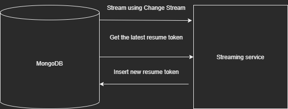

# Python MongoDB Change Stream To Big Query



This repository is a POC of using MongoDB change stream to Bigquery. Every changes in MongoDB are being streamed using Mongo Change Stream and the streamed data will be pushed in BigQuery. The tools I've used are:
- Pymongo
- AsyncIO
- Bigquery


Persisted the resume token in a table to make sure that the changes we stream are already success. To run this POC follow these steps:

Run the Mongo DB image using docker-compose:
```bash
docker-compose up -d
```

Once the MongoDB is running install all the dependency required using pip.
```bash
pip3 install -r requirements.txt
```

The last step is run the script using python.
```bash
python3 index.py
```


### Testing
To test the application execute to the MongoDB container using:
```bash
docker exec -it <container-id> mongo
```

Make sure you are in `live` database
```
use live
```

Try to insert a json data in items:
```
db.items.insert({"name": "Testing"}
```

The application should log that the the row is successfully added in BigQuery.


### Note
Make sure to change the bigquery table path variable inside the script.

